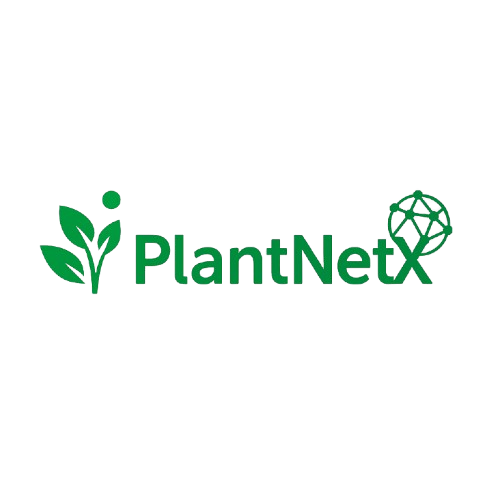

# 🌱 PlantNetX

<p align="center">
  
</p>

<h3 align="center">
A Comprehensive Plant Gene Expression Database Integrating Bulk RNA-Seq, Single-Cell Transcriptomics, Gene Co-expression Networks, and Functional Genomics
</h3>

<p align="center">

[](https://plantnetx.academic.kube.ohio.edu/)


</p>

---

## 📖 Overview

**PlantNetX** is an integrated plant transcriptomics platform designed to facilitate the exploration of plant gene expression across multiple biological scales. The database combines **bulk RNA sequencing (bulk RNA-Seq)** and **single-cell RNA sequencing (scRNA-Seq)** datasets into a unified framework, enabling researchers to investigate gene expression, construct co-expression networks, identify regulatory modules, and discover functionally related genes across diverse plant species.

Unlike traditional expression databases that focus on either bulk or single-cell datasets independently, PlantNetX integrates both data types to provide comprehensive insights into plant biology. Researchers can examine tissue-wide expression patterns, investigate cellular heterogeneity, identify candidate genes, and explore functional relationships using interactive visualizations and network analysis tools.

PlantNetX serves as a comprehensive resource for researchers in:

- Plant Genomics
- Functional Genomics
- Systems Biology
- Molecular Biology
- Computational Biology
- Plant Breeding
- Crop Improvement
- Transcriptomics
- Gene Regulatory Network Analysis

---

## 🌐 Live Website

**https://plantnetx.academic.kube.ohio.edu/**

---

# ✨ Features

## 🌱 Bulk RNA-Seq Expression Database

PlantNetX integrates large-scale publicly available bulk RNA-Seq datasets covering multiple plant species and experimental conditions.

Features include:

- TPM normalized gene expression
- Tissue-specific expression profiles
- Organ-specific expression
- Developmental stage expression
- Abiotic stress datasets
- Biotic stress datasets
- Experimental condition filtering
- Gene-level expression visualization

---

## 🔬 Single-Cell RNA-Seq Analysis

The platform incorporates single-cell transcriptomic datasets for high-resolution cellular expression analysis.

Supported analyses include:

- Cell clustering
- Cell type annotation
- UMAP visualization
- PCA visualization
- Marker gene analysis
- Cell-specific expression
- Differential expression analysis
- Interactive exploration of cellular heterogeneity

---

## 🧬 Gene Co-expression Network

PlantNetX enables construction and exploration of gene co-expression networks generated from large-scale transcriptomic datasets.

Network analysis includes:

- Pearson Correlation Coefficient (PCC)
- Mutual Rank (MR)
- Gene neighborhood discovery
- Co-expression modules
- Regulatory module identification
- Candidate gene prediction
- Functional network visualization

---

## 📚 Functional Annotation

Integrated annotations include:

- Gene Ontology (GO)
- KEGG Pathways
- Pfam Domains
- Protein Family Classification
- Functional descriptions
- Gene metadata
- Ortholog information
- Gene aliases

---

## 📊 Interactive Visualization

PlantNetX provides publication-quality visualizations including:

- Expression Heatmaps
- Expression Boxplots
- Violin Plots
- Dot Plots
- UMAP Embeddings
- PCA plots
- Network Graphs
- Tissue Expression Profiles
- Cell Type Expression Maps

---

## 🔍 Advanced Search

Users can search using:

- Gene ID
- Gene Symbol
- Gene Description
- Species
- Tissue
- Organ
- Cell Type
- GO Term
- Pfam Domain
- KEGG Pathway
- Functional Keyword

---

# 🗂 Database Contents

PlantNetX integrates multiple biological resources including:

- Bulk RNA-Seq datasets
- Single-cell RNA-Seq datasets
- Gene expression matrices
- Functional annotations
- Gene Ontology annotations
- KEGG pathways
- Pfam protein domains
- Co-expression networks
- Gene metadata
- Sample metadata

---

# 🖥 Technology Stack

## Backend

- Python 3.11
- Django
- Django REST Framework

## Frontend

- HTML5
- CSS3
- JavaScript
- Bootstrap

## Database

- PostgreSQL

## Data Analysis

- Scanpy
- Pandas
- NumPy
- SciPy
- NetworkX
- Matplotlib

## RNA-Seq Processing

- FastQC
- fastp
- STAR
- SAMtools

## Single-cell Processing

- Scanpy
- Leiden Clustering
- PCA
- UMAP
- Differential Expression Analysis

---

# 📂 Data Processing Pipeline

## Bulk RNA-Seq Workflow

```text
Raw FASTQ Files
        │
        ▼
FastQC
        │
        ▼
fastp
        │
        ▼
STAR Alignment
        │
        ▼
Read Quantification
        │
        ▼
TPM Normalization
        │
        ▼
Expression Matrix
        │
        ▼
Co-expression Network Construction
```

---

## Single-Cell RNA-Seq Workflow

```text
Raw FASTQ
      │
      ▼
Quality Control
      │
      ▼
Read Alignment
      │
      ▼
Cell Filtering
      │
      ▼
Normalization
      │
      ▼
Highly Variable Genes
      │
      ▼
PCA
      │
      ▼
Neighbor Graph
      │
      ▼
Leiden Clustering
      │
      ▼
UMAP
      │
      ▼
Marker Gene Detection
```

---

# 📈 Scientific Applications

PlantNetX supports research in:

- Functional Genomics
- Comparative Transcriptomics
- Gene Function Prediction
- Candidate Gene Discovery
- Gene Regulatory Networks
- Systems Biology
- Crop Improvement
- Stress Biology
- Developmental Biology
- Single-cell Biology
- Evolutionary Biology

---

# 🚀 Getting Started

Clone the repository

```bash
git clone https://github.com/YOUR_USERNAME/PlantNetX.git
```

Move into the project directory

```bash
cd PlantNetX
```

Create a virtual environment

```bash
python -m venv venv
```

Activate the environment

Linux/macOS

```bash
source venv/bin/activate
```

Windows

```bash
venv\Scripts\activate
```

Install dependencies

```bash
pip install -r requirements.txt
```

Run migrations

```bash
python manage.py migrate
```

Start the development server

```bash
python manage.py runserver
```

Open

```
http://127.0.0.1:8000
```

---

# 📊 Why PlantNetX?

PlantNetX bridges the gap between conventional bulk transcriptomics and single-cell transcriptomics by integrating both data modalities into a single platform. The database enables researchers to investigate gene function from tissue-wide expression patterns down to individual cell populations, facilitating multi-scale analyses of plant biological systems.

The integration of co-expression network analysis, functional annotation, and interactive visualization makes PlantNetX a valuable resource for hypothesis generation, candidate gene prioritization, and systems-level understanding of plant gene regulation.

---

# 📖 Citation

If you use PlantNetX in your research, please cite:

```text
Citation information will be added after publication.
```

---

# 🤝 Contributing

Contributions are welcome!

If you would like to contribute:

1. Fork the repository.
2. Create a new feature branch.
3. Commit your changes.
4. Push to your branch.
5. Open a Pull Request.

Please read `CONTRIBUTING.md` before submitting contributions.

---

# 🐞 Reporting Issues

If you encounter bugs or have feature requests, please open an issue on GitHub.

Please include:

- Operating system
- Browser
- Python version (if applicable)
- Steps to reproduce
- Expected behavior
- Screenshots (if available)

---

# 📄 License

This project is licensed under the **MIT License**.

See the `LICENSE` file for details.

---

# 👨‍🔬 Maintainers

**Mohsin Ali Nasir**

Bioinformatics Researcher

GitHub: https://github.com/Mohsin-OU

Email: mn667421@ohio.edu

---

# 🌍 Website

https://plantnetx.academic.kube.ohio.edu/

---

# 🙏 Acknowledgments

PlantNetX was developed to provide the plant research community with an integrated platform for large-scale transcriptomic exploration, gene co-expression analysis, and functional genomics research.

We acknowledge the public repositories, sequencing consortia, and research communities whose datasets make integrative plant transcriptomic analyses possible.

---

## ⭐ Support the Project

If you find PlantNetX useful in your research, please consider giving this repository a ⭐ on GitHub to support future development.
